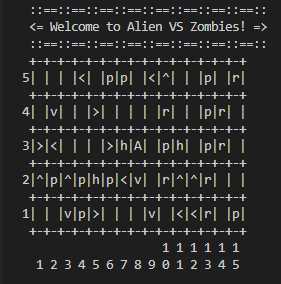

# Alien vs. Zombie

Alien vs Zombie is a simplified, text-based version of the game named Alien Path available in Android and iOS. This is a game where players need to control alien to defeat all the zombies on the board with the help of its special movement behaviour and game objects. The game is currently in progress and will be done soon.



[Video Demo](https://youtu.be/eaBwKwTLEzQ).

## Compilation Instructions

To compile this program, please type this in the terminal

```
g++ AlienVSZombies.cpp -o game
```

## User Manual

Run the .exe file. You'll have 4 options which are play the game, load file, change settings, and quit.

__Playing The Game:__

It will display gameboard that consist of Alien, Zombies and Game Objects.
Alien = 'A'
Zombies = '1 ~ 9'
Game Objects consist of 6 different Items;
>- '^' = Change the direction of Alien upwards
>- '>' = Change the direction of Alien to the right
>- '<' = Change the direction of Alien to the left
>- 'v' = Change the direction of Alien downwards
>- 'r' = Stop the alien movement and become random Game Objects
>- 'p' = Give damage to random Zombies
>- 'h' = Heal Alien 20HP

__Commands for Alien;__

>1. 'up'    = Move Alien upwards
>2. 'right' = Move Alien to the right
>3. 'left'  = Move Alien to the left
>4. 'down'  = Move Alien downwards
>5. 'arrow' = Switch the direction of an arrow 
>6. 'help'  = Display all the commands
>7. 'quit,  = Exit the game 

__Change Settings:__

Default;
>- Row number     = 5
>- Column numbers = 15
>- No of Zombies  = 2 <br><br>
> You can change the settings for row, column and Zombies. <br>
> _Note : __Minimum__ number of Zombies is 1 and __Maximum__ is 9_

__Quit:__
> Exit the game
## Progress Log

- [Part 1](PART1.md)
- [Part 2](PART2.md)

## Contributors

- MUHAMMAD HAIKAL AFIQ BIN RAFINGEI
- AHMAD HAIKAL BIN EMRAN
- MOHD AZRIY AKMALHAZIM BIN MOHD NAZARIEE


